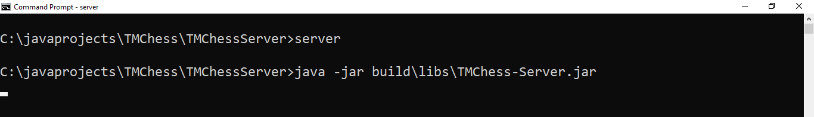
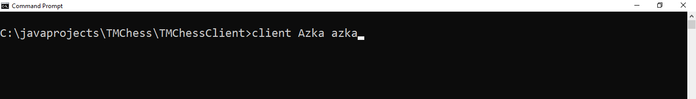
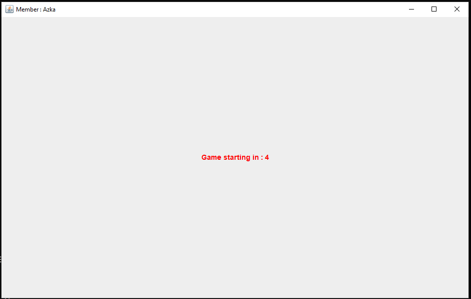
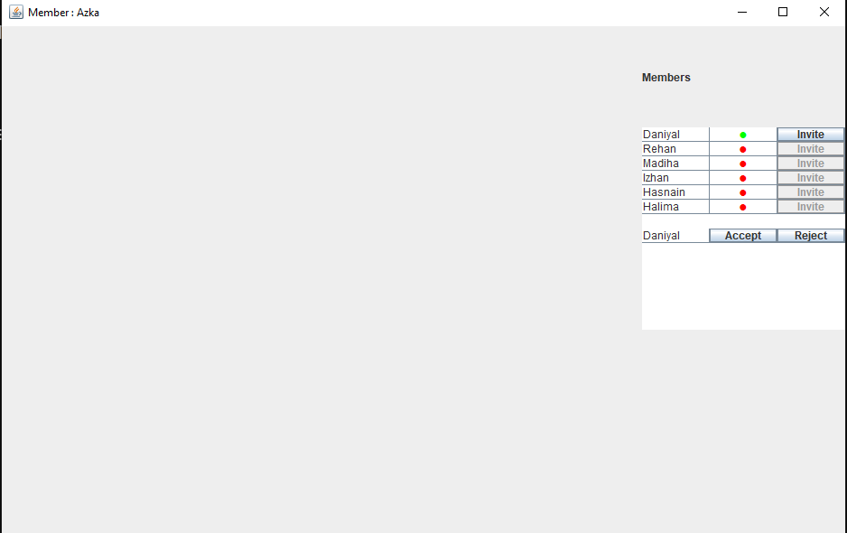
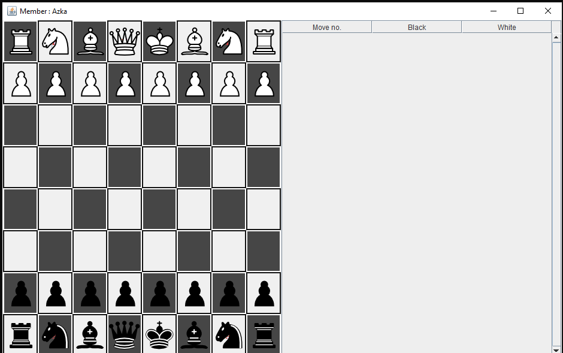
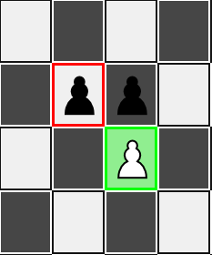
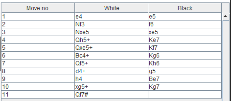
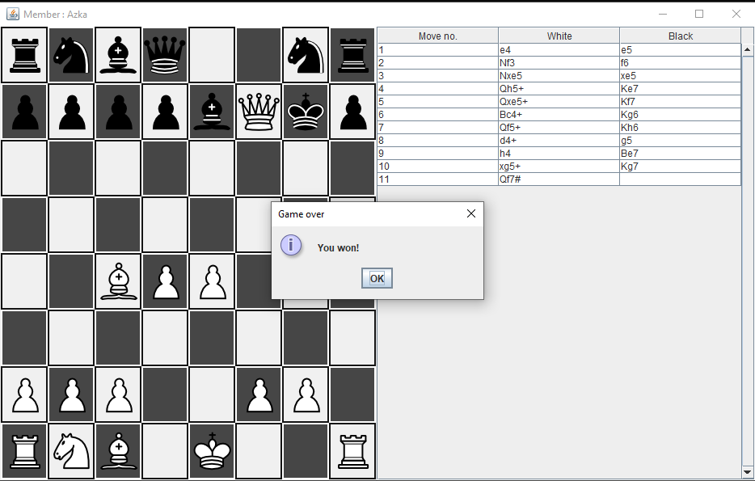
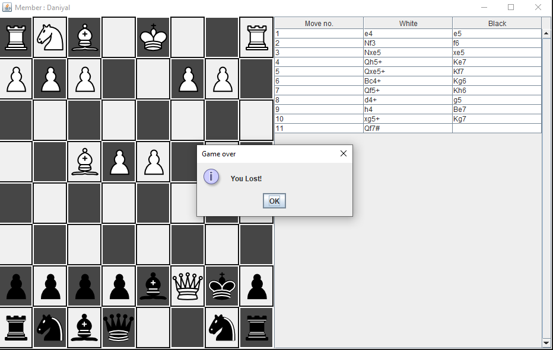

# TMChess - Multiplayer Chess Game  

TMChess is a multiplayer chess game built with Java, featuring real-time gameplay, move validation, history tracking, and a well-designed GUI. It supports early checkmate detection, check validation, castling, and color-highlighted move indicators.  

---

## 🛠 Features  
- **Multiplayer Chess:** Play against another player in real time.  
- **Move Validation:** Ensures only legal moves are allowed.  
- **Check & Checkmate Detection:** Alerts players when the king is in check or checkmate.  
- **Castling Fixes:** Fixed UI and logic bugs for castling.  
- **Highlighted Moves:**
  - **Green** → Possible moves  
  - **Red** → Capture moves  
  - **Golden Yellow** → Castling moves  
- **Move History Table:** Tracks all moves made during the game.  
- **Flipped Board for Black Player:** Adjusts the board view for each player.  
- **Server-Client Architecture:** Runs on a dedicated server for seamless play.  
- **Member & Inbox Tables:** Manage active players and game invites.  

---

## 📷 Screenshots  

| Feature | Screenshot |
|---------|------------|
| **Server Running** |  |
| **Client Execution Command** |  |
| **Game Starting Panel (Countdown)** |  |
| **Member Table** |  |
| **Inbox Table** |  |
| **Flipped Board for Black** |  |
| **Highlighted Moves (Green, Red, Golden Yellow)** |  |
| **Move History Table** |  |
| **Check Situation** |  |
| **Checkmate Situation** |  |
| **White Won** |  |
| **Black Lost** |  |

---

## 🚀 Installation & Setup  

### 1️⃣ **Download the Release**  
Get the latest release from [TMChess Releases](https://github.com/your-repo/tmchess/releases).  

### 2️⃣ **Run the Server**  
Before starting the game, launch the server:  
```sh
java -jar build/libs/TMChess-Server.jar

### 3️⃣ **Run the Client**  
Each player should run the client with the server IP and their username:  
```sh
java -jar build/libs/TMChess-Client.jar <username> <password>
```

Example:  
```sh
java -jar build/libs/TMChess-Client.jar Daniyal daniyal
```

### 4️⃣ **Start Playing!**  
- Create a match and invite an opponent.  
- Make legal moves while avoiding self-check.  
- Capture, check, or checkmate your opponent!  

---

## 📝 Changelog  

### **v1.1** - Latest Update  
✅ Fixed **King Castling Bug** (caused by a single line of code, took an hour to find in the wrong file 😆).  
✅ Updated **GUI Highlights** (Green for moves, Red for captures, Golden Yellow for castling).  
✅ **Move History Table** implemented for tracking all game moves.  
✅ Various **bug fixes & UI improvements**.  

### **v1.0** - Initial Release  
- Core **multiplayer chess** functionality.  
- Basic **move validation** and piece movement.  
- Early checkmate detection.  

---

## 📌 Future Improvements  
- Add support for en passant and stalemate detection.  
- Improve **AI-based move suggestions**.  
- Implement **time controls** for competitive play.  
- Mobile & Web versions (in the future 🚀).  

---

## 🤝 Contributing  
Want to contribute? Fork the repo and submit a pull request!  

---

## 📧 Contact  
For issues or feature requests, reach out at **mohammeddaniyal453@gmail.com**.  
GitHub: [Mohammeddaniyal](https://github.com/Mohammeddaniyal)  

---

♟️ **Enjoy Playing TMChess!** 🏆  
```
TMCHESS better version of chess repository